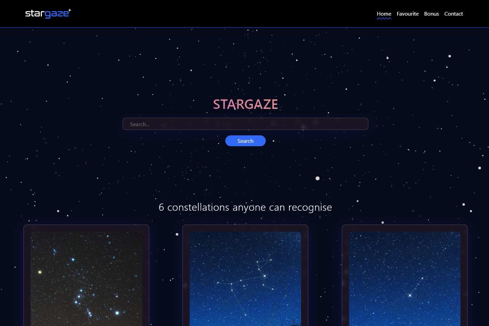

# Project 2 - Stargaze 

# Mardown badges
      

# Table of contents
- [Markdown Badges](#markdown-badges)
- [Description](#description)
- [Usage](#usage)
- [Installation](#installation)
- [Live Application](#live-application)
- [Future Implementation](#future-implementation)
- [Contribution](#contribution)
- [Authors](#authors)

## Description

#### Allows users to search any and all information that the NASA open API holds for researchers, enthusiast or students, enabling the end user to improve their knowlegde on all things space related 

## Usage
#### When user imputs any star, constellation or any space related info, the page returns three cards with information and a picture of what user searched for, they can navigate to different pages on the webpage which will host different content highlighting the current page with a blue underline style. The bonus page will post the astronomy picture of the day so that users will always have something new to look at. users can get started by looking at some most commonly known constellations with links to wikipedia for more in depth information.

 

## Technologies Used
>#### NASA open APIs (two end points used)
>#### Three Fiber
>#### React Icons

 

## Installation 

Follow this [Link](https://github.com/facebook/create-react-app#creating-an-app) to get your react app started and all relevant documentation needed.

 

## Live Application

Click [here](https://alecerf01.github.io/Geezer-Project/) to go to the application.

 

>Below is a screenshot of the appllication.

 

## Future Implementation

#### In the future we will add additional functionality to the search input so it has a separate input field for artists. We will also create a clear button, so end user is able to clear search history.  

 

## Contribution

To contribute to this project create a clone of this repo on your local computer and create a pull request to add any features that are wanted or contact us through our githubs.

 

## Authors
 
 * [Alexis-Charles Lecerf (Alex)](https://github.com/alecerf01)
 * [Marzena Wilk (Maggie)](https://github.com/Marzena-W)
 * [Ryan Dutton](https://github.com/ryanpauldutton)
